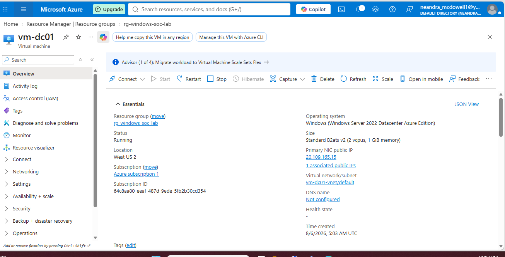
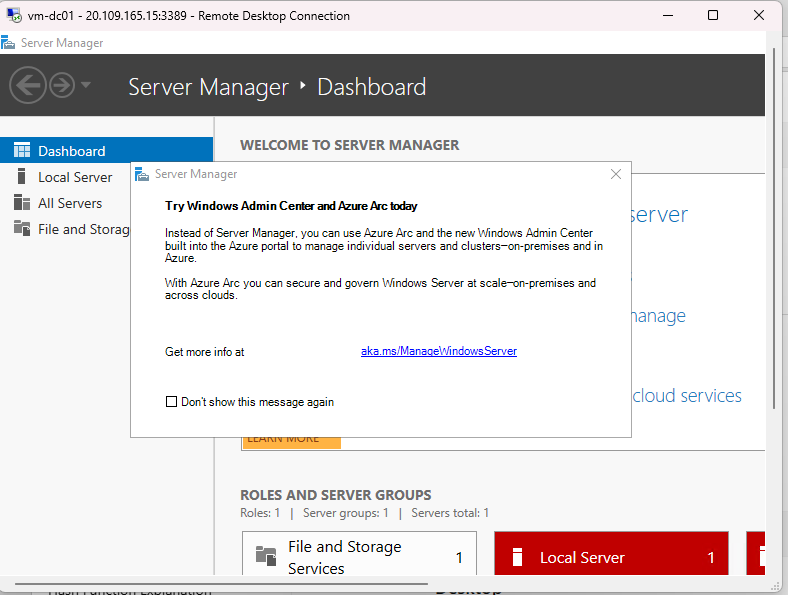
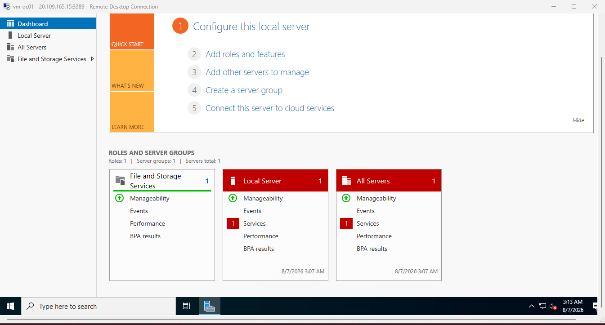

# 🖥️ Connecting to the Azure Virtual Machine

---

# 📖 Objective

The objective of this phase was to remotely connect to the deployed Windows Server virtual machine using Microsoft's Remote Desktop Protocol (RDP).

---

# Technologies Used

- Microsoft Azure
- Azure Virtual Machines
- Remote Desktop Protocol (RDP)
- Windows Server 2022

---

# VM Overview

The virtual machine was successfully deployed and entered the Running state.

---

# Remote Desktop Connection

After downloading the RDP file from Azure, I successfully authenticated using the administrator credentials created during deployment.

---

# Windows Server Desktop

The Windows Server desktop loaded successfully, confirming the deployment completed without errors.

---

# Skills Demonstrated

- Azure Virtual Machines
- Remote Administration
- Windows Server
- Remote Desktop Protocol (RDP)
- Infrastructure as a Service (IaaS)

---

# Lessons Learned

Connecting to the virtual machine reinforced my understanding of Azure Virtual Machines and Remote Desktop Protocol. Successfully logging into the server confirmed the deployment was functional and ready for additional administration tasks.
